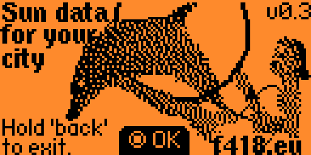
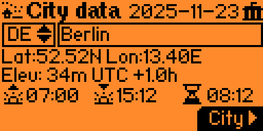

# mitzi-astro
A Flipper Zero app to calculate sunset and sunrise for today for many European cities.

The user first can choose country and then a city from a filtered list. The sunset, sunrise, and the daylight hours are immediately displayed.

## The user flow
The **Splash Screen** displays app title and version information, you can proceed with `OK` or exit.
The **City Data Screen** has two menu boxes, the country selector (with 2-letter ISO country codes) and the city selector. Based on the choices, the user sees:
* Capital Indicator icon appears for capital cities
* Latitude, longitude, elevation, and UTC offset
* Sunset, sunrise, and daylight hours

## Key Functions
* `load_cities_from_csv()` loads city data from external CSV file
* `filter_cities_by_country()` filters city list based on selected country
* `draw_callback()` renders UI based on current screen and state
* `input_callback()`h andles button input events

## Further notes.
The **data file** is located at `/ext/apps_data/mitzi-astro/european_cities.txt` (note the ending `txt`). It is in CSV with fields like `country_code`, `utc_shift`, `city_name`, `longitude`, `latitude`, `elevation_m`. It supports up to 200 cities (hard-coded, but easy to change).

## Sun maths
Currently, a simplified formula is being used. The goal is to (real soon now) use the function `SunTimes sun(int year, int month, int day, int lat_degree, int lat_minute, int lon_degree, int lon_minute, int height_meters, float time_zone_offset_to_utc_in_hours)` located in [suntimes.c](suntimes.c) to compute for any date between year 0 and 3000. The formulas are from https://gml.noaa.gov/grad/solcalc/calcdetails.html
* astronomical dawn and astronomical dusk,
* nautical dawn and nautical dusk,
* civil dawn and civil dusk,
* sunrise, sunset,
* day length,

The function returns a `SunTimes`, including a field `comment` reflecting special conditions (polar night or day!) or errors (non-existent dates during the 1582 Gregorian calendar reform).

# Links and further reading
* [Mitzi (C. C. Odontoceti)](https://www.floridamemory.com/items/show/82844) was a movie star, born in 1958 and died in 1972.
* https://developer.flipper.net/flipperzero/doxygen/applications.html is the official (too) short introduction to writing own apps.
* An inspiring app to get acquainted with Flipper Zero is **tuning fork**, which is rather well documented, see https://github.com/besya/flipperzero-tuning-fork/tree/main 
* Under https://github.com/flipperdevices/flipperzero-firmware/tree/dev/assets/icons/Common we find nice icons, e.g. `ButtonLeft_4x7.png`.
* You probably know: To compile the code, you need [uFBT](https://github.com/flipperdevices/flipperzero-ufbt) aka *micro Flipper Build Tool*, it requires python to be installed. 
